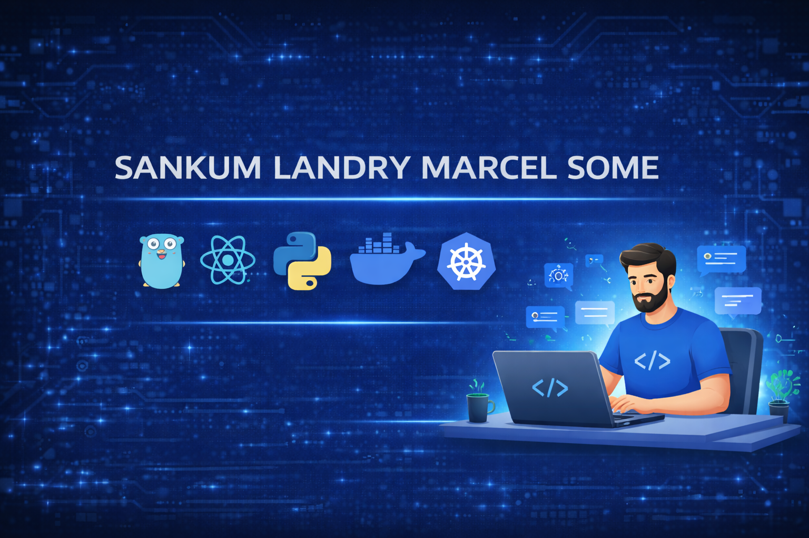

# 👋 Hi there! Welcome to my GitHub Profile

A senior <b>Golang</b> and <b>React</b>-driven full-stack engineer with 9+ years of experience architecting and delivering highly scalable, fault-tolerant systems, transforming complex business requirements into elegant, high-performance microservices and user-centric applications operating reliably at production scale on <b>AWS</b>.

## 🌟 About Me
- 🔭 **Currently working on**: Sr Sofrware Engineer
- 🌱 **Currently learning**: AI

---

---

## How to reach me

- Email: landrysome007@gmail.com
- Phone: 678-258-9665
- Linkedin: https://www.linkedin.com/in/lsome

## 🚀 My Tech Stack
Here are some tools, languages, and frameworks I use:
- **Languages**: Golang, Python, Javascript
- **Frameworks/Libraries**: React, Fiber, Django/Flask
- **Tools/Platforms**: Git, Docker, AWS, Kubernetes

Thanks for visiting my profile! 🚀
